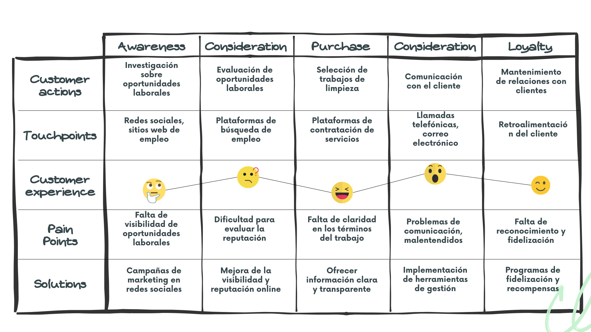

# Universidad Peruana de Ciencias Aplicadas

Ingeniería de Software

Ciclo 2024-01

# 
Aplicaciones Web

## TB1 REPORT

**Sección:** SI91

**Profesor**: Hugo Allan Mori Paiva

**StartUp Name**: CleanWave

**Producto**: CleanWave

### Team Members:

| Member                            |    Code    |
| :-------------------------------- | :--------: |
| Garcia Moscoso, Andrea Joselyn    | u201921060 |
| Solis Solis, Leonardo Jose        | u20211G163 |
| Mejia Aliaga, Katherine Maryory   | u20221a118 |
| Huaman Monzon, Juan Diego     | u202114309 |

 
  

# Registro de Versiones del Informe

| Versión |  Fecha    |                                                                                       Autor                                                                                        | Descripción de modificación                                                                                                                                           |
| :-----: | :--------: | :--------------------------------------------------------------------------------------------------------------------------------------------------------------------------------: | :-------------------------------------------------------------------------------------------------------------------------------------------------------------------- |
|   TB1   | 06/09/2023 | Garcia Moscoso, Andrea Joselyn    Solis Solis, Leonardo Jose    Mejia Aliaga, Katherine Maryory     Conde Isla, Camila Alessandra    Pasquale Barrenechea, Gianluca Santino | Se realizaron los Capítulos I: Introducción, Capítulo II: Requirements Elicitation & Analysis, Capítulo III: Requirements Specification y Capítulo IV: Product Design |

  

[**CAPÍTULO 1: INTRODUCCIÓN**](#capítulo-1-introducción)

> [1.1. Startup Profile](#startup-profile.) 
>
> [1.1.1. Descripción de la Startup](#descripción-de-la-startup.) 
>
> [1.1.2. Perfiles de integrantes del
> equipo](#perfiles-de-integrantes-del-equipo.) 
>
> [1.2. Solution Profile](#solution-profile) 
>
> [1.2.1. Antecedentes y problemática](#antecedentes-y-problemática) 
>
> [1.2.2. Lean UX Process.](#lean-ux-process.) 
>
> [1.2.2.1. Lean UX Problem Statements](#lean-ux-problem-statements.) 
>
> [1.2.2.2. Lean UX Assumptions.](#lean-ux-assumptions.) 
>
> [1.2.2.3. Lean UX Hypothesis
> Statements.](#lean-ux-hypothesis-statements.) 
>
> [1.2.2.4. Lean UX Canvas.](#lean-ux-canvas.) 
>
> [1.3. Segmentos objetivo.](#segmentos-objetivo.) 

[**CAPÍTULO 2:REQUIREMENTS ELICITATION &
ANALYSIS**](#capítulo-2requirements-elicitation-analysis) 

> [2.1. Competidores](#competidores.) 
>
> [2.1.1. Análisis competitivo.](#análisis-competitivo.) 
>
> [2.1.2. Estrategias y tácticas frente a
> competidores.](#estrategias-y-tácticas-frente-a-competidores.) 
>
> [2.2. Entrevistas.](#entrevistas.) 
>
> [2.2.1. Diseño de entrevistas.](#diseño-de-entrevistas.) 
>
> [2.2.2. Registro de entrevistas.](#registro-de-entrevistas.) 
>
> [2.2.3. Análisis de entrevistas.](#análisis-de-entrevistas) 
>
> [2.3. Needfinding.](#needfinding) 
>
> [2.3.1. User Personas.](#user-personas) 
>
> [2.3.2. User Task Matrix.](#user-task-matrix.) 
>
> [2.3.3. User Journey Mapping.](#user-journey-mapping.) 
>
> [2.3.4. Empathy Mapping.](#empathy-mapping.) 
>
> [2.3.5. As-is Scenario Mapping.](#as-is-scenario-mapping) 
>
> [2.4. Ubiquitous Language.](#ubiquitous-language.) 

[**CAPÍTULO 3: REQUIREMENTS
SPECIFICATION**](#capítulo-3-requirements-specification) 

> [3.1. To-Be Scenario Mapping.](#to-be-scenario-mapping.) 
>
> [3.2. User Stories.](#user-stories.) 
>
> [3.3. Impact Mapping.](#impact-mapping) 
>
> [3.4. Product Backlog.](#product-backlog) 

[**CAPÍTULO 4: PRODUCT DESIGN**](#capítulo-4-product-design)

> [4.1. Style Guidelines.](#style-guidelines.) 
>
> [4.1.1. General Style Guidelines.](#general-style-guidelines.) 
>
> [4.1.2. Web Style Guidelines.](#web-style-guidelines.) 
>
> [4.2. Information Architecture](#information-architecture.) 
>
> [4.2.1. Organization Systems.](#organization-systems.) 
>
> [4.2.2. Labeling Systems.](#labeling-systems.) 
>
> [4.2.3. SEO Tags and Meta Tags](#seo-tags-and-meta-tags.)
>
>
> [4.2.4. Searching Systems.](#searching-systems.) 
>
> [4.2.5. Navigation Systems](#navigation-systems.) 
>
> [4.3. Landing Page UI Design.](#landing-page-ui-design.) 
>
> [4.3.1. Landing Page Wireframe.](#landing-page-wireframe.) 
>
> [4.3.2. Landing Page Mock-up.](#landing-page-mock-up.) 
>
> [4.4. Web Applications UX/UI Design.](#web-applications-uxui-design.)
> 
>
> [4.4.1. Web Applications Wireframes.](#web-applications-wireframes.)
>
>
> [4.4.2. Web Applications Wireflow
> Diagrams.](#web-applications-wireflow-diagrams.) 
>
> [4.4.3. Web Applications Mock-ups.](#web-applications-mock-ups) 
>
> [4.4.4. Web Applications User Flow
> Diagrams.](#web-applications-user-flow-diagrams-user-goal-ingresar-a-la-pantalla-principal-de-la-aplicación)
> 
>
> [4.5. Web Applications Prototyping.](#web-applications-prototyping) 
>
> [4.6. Domain-Driven Software
> Architecture.](#domain-driven-software-architecture) 
>
> [4.6.1. Software Architecture Context
> Diagram.](#software-architecture-context-diagram) 
>
> [4.6.2. Software Architecture Container
> Diagrams](#software-architecture-container-diagrams) 
>
> [4.6.3. Software Architecture Components
> Diagrams.](#software-architecture-components-diagrams) 
>
> [4.7. Software Object-Oriented
> Design.](#software-object-oriented-design.) 
>
> [4.7.1. Class Diagrams.](#class-diagrams.) 
>
> [4.7.2. Class Dictionary.](#class-dictionary.) 
>
> [4.8. Database Design.](#database-design.) 
>
> [4.8.1. Database Diagram.](#database-diagram.) 

[**CAPÍTULO 5: PRODUCT IMPLEMENTATION, VALIDATION &
DEPLOYMENT**](#capítulo-5-product-implementation-validation-deployment)

> [5.1. Software Configuration
> Management](#software-configuration-management.) 
>
> [5.1.1. Software Development Environment
> Configuration.](#software-development-environment-configuration.) 
>
> [5.1.2. Source Code Management.](#source-code-management.) 
>
> [5.1.3. Source Code Style Guide &
> Conventions.](#source-code-style-guide-conventions.) 
>
> [5.1.4. Software Deployment
> Configuration.](#software-deployment-configuration.) 
>
> [5.2. Landing Page, Services & Applications
> Implementation.](#landing-page-services-applications-implementation.)
> 15
>
> [5.2.1. Sprint n](#sprint-1.) 
>
> [5.2.1.1. Sprint Planning n.](#sprint-planning-1.) 
>
> [5.2.1.2. Sprint Backlog n.](#sprint-backlog-1.) 
>
> [5.2.1.3. Development Evidence for Sprint
> Review.](#development-evidence-for-sprint-review.) 
>
> [5.2.1.4. Testing Suite Evidence for Sprint
> Review.](#testing-suite-evidence-for-sprint-review.) 
>
> [5.2.1.5. Execution Evidence for Sprint
> Review](#execution-evidence-for-sprint-review.) 
>
> [5.2.1.6. Services Documentation Evidence for Sprint
> Review.](#services-documentation-evidence-for-sprint-review.) 
>
> [5.2.1.7. Software Deployment Evidence for Sprint
> Review.](#software-deployment-evidence-for-sprint-review.) 
>
> [5.2.1.8. Team Collaboration Insights during
> Sprint.](#team-collaboration-insights-during-sprint.) 
>
> [5.3. Validation Interviews.](#_4h042r0) 
>
> [5.3.1. Diseño de Entrevistas.](#_2w5ecyt) 
>
> [5.3.2. Registro de Entrevistas](#_1baon6m) 
>
> [5.3.3. Evaluaciones según heurísticas.](#_3vac5uf) 
>
> [5.4. Video About-the-Product.](#_2afmg28) 

[**CONCLUSIONES**](#conclusiones) 

[**BIBLIOGRAFÍA**](#bibliografía) 

[**ANEXOS**](#anexos) 

# CAPÍTULO 1: INTRODUCCIÓN

## Startup Profile.

### Descripción de la Startup.

> CleanWave es una aplicación web innovadora diseñada para simplificar
> la contratación de servicios de limpieza. Nuestro objetivo principal
> es ofrecer una experiencia eficiente a todos los usuarios que buscan
> contratar este tipo de servicios. La aplicación garantiza un entorno
> seguro y confiable para lograr nuestro objetivo. CleanWave será de
> fácil uso, ya que, los usuarios no tendrán que buscar empresas de
> limpieza o personas que realicen el servicio, ya que nosotros nos
> encargaremos de ese proceso. El usuario solo tendrá que adquirir una
> suscripción, al hacerlo podrá solicitar el servicio cuando desee sin
> tener que esperar cotizaciones o respuestas del emprendimiento de
> limpieza. Las suscripciones se dividen en tres categorías, al
> completar la información requerida, la aplicación asignará al usuario
> a una de estas categorías. Posteriormente, solo tendrá que ingresar la
> fecha y hora en la que requiera el servicio. Poco después recibirá una
> confirmación detallada sobre la información del personal asignado para
> llevar a cabo la limpieza.

### Perfiles de integrantes del equipo.

Leonardo Jose Solis Solis - U20211G163 - Ing. de Software

Soy Leonardo Solis, desde pequeño me gustan los videojuegos y esto a su
vez me llevó a investigar cómo estaban hechos, descubriendo la
programación e impulsando a seguir investigando más acerca de este
mundo.

Andrea Garcia - U201921060 - Ing. de Software

Actualmente estoy cursando el quinto ciclo de mi carrera. Elegí esta
carrera debido a que desde la niñez me interesó el cómo funcionan las
computadoras por dentro. Poseo conocimiento en programación estructurada
y POO. Además, tengo habilidades en el trabajo en equipo y trabajo en
tareas múltiples.

Katherine Maryory Mejia Aliaga - U20221A118 - Ing. de Software

> Me encuentro en el quinto ciclo de la carrera de
>
> Ingeniería de Software. Tengo conocimientos en
>
> C++, Phyton y HTML. Me gusta trabajar en equipo
>
> y a la vez sacar lo mejor de mis compañeros para hacer un
>
> buen trabajo. Además, tengo capacidad y aptitud
>
> para generar nuevas e innovadoras ideas y siempre
>
> estoy dispuesta a adquirir nuevas habilidades y
>
> conocimientos.

Juan Diego Huamán - U202123965 - Ing. de Software

Actualmente me encuentro cursando el 6to ciclo de la carrera de
Ingeniería de Software. He adquirido conocimientos es C++, C#, HTML, CSS
y JavaScript, además de el manejo de bases de datos con SQL. Cuento con
pensamiento crítico y me considero autodidacta lo que me permite aportar
a mi grupo cada vez que se necesite.

## Solution Profile

### Antecedentes y problemática

-   Who\
    Usuarios objetivo: Personas que buscan contratar servicios de
    limpieza de manera rápida y confiable. Además, personas que desean
    ofrecer servicios de limpieza sin tener que formar parte de una
    empresa.

-   What\
    CleanWave es una aplicación móvil que ofrece el servicio de
    limpieza. Además, cuenta con una landing page para promover dicho
    servicio.

  

-   Where\
    La aplicación estará disponible en dispositivos web, accesible desde
    cualquier lugar donde los usuarios tengan conexión a internet.

-   When\
    La aplicación estará disponible para su descarga y uso en cualquier
    momento una vez lanzada al mercado. La programación de la
    realización podrá ser agendada en cualquier horario.

-   Why

 El propósito de CleanWave es ofrecer una solución eficiente para las
 personas que necesiten acceder a servicios de limpieza. Además, busca
 ayudar a las personas que ofrecen dichos servicios de manera
 independiente.

-   How\
    La aplicación funcionará mediante un modelo de suscripción, donde
    los usuarios tendrán que pagar una de los tres tipos de suscripción
    para acceder al servicio.

-   How Much

 Dependiendo de las especificaciones del servicio que necesite el
 usuario se le dirá el tipo de suscripción que se acople a sus
 necesidades.

### Lean UX Process.

#### Lean UX Problem Statements.

> Domain: En el mercado de servicios de limpieza, los clientes
> experimentan dificultad para encontrar al personal adecuado para
> confiar sus inmuebles y agendar el día del servicio de manera rápida y
> eficaz.
>
> Customer Segments: Personas que necesiten servicios de limpieza que
> sean mayores de edad y de cualquier nivel socioeconómico.
>
> Pain Points: La dificultad para encontrar días disponibles en las
> empresas que ofrecen el servicio, largo tiempo de espera para tener
> una cotización, tener que adaptarse a los horarios de las empresas.
>
> Gap: Existe una brecha entre la demanda de servicios de limpieza y la
> disponibilidad de recursos para satisfacer esta demanda de manera
> eficiente.
>
> Visión/Strategy: Facilitar la búsqueda y reserva de servicios de
> limpieza, a través de una plataforma digital, ofreciendo conveniencia
> y eficiencia a los usuarios.
>
> Initial Segment: Personas mayores de edad que buscan eficiencia en la
> realización del servicio y la seguridad para encargar sus inmuebles.

#### Lean UX Assumptions.

> Assumption 1:
>
> Creemos que las personas que requieran el servicio de limpieza
> prefieren pagar por una suscripción en lugar de llamar a varias
> empresas para cotizar precios.
>
> Assumption 2:
>
> Suponemos que los emprendedores ofrezcan el servicio están dispuestos
> a registrarse en la plataforma para ampliar su clientela y no tener
> que preocuparse por agendar citas o hacer cotización a los clientes.
>
> Assumption 3:
>
> Creemos que los usuarios estarán dispuestos a pagar las suscripciones
> que más se acomoden a las necesidades del servicio.

#### Lean UX Hypothesis Statements.

Hypothesis Statement 1:\
Si proporcionamos a los usuarios una aplicación móvil fácil de usar para
agendar el día que se hará el servicio, entonces aumentará la frecuencia
de uso y la satisfacción del usuario.

Hypothesis Statement 2:\
Si logramos asociarnos con un número significativo de personas
independientes o emprendimientos de limpieza locales, entonces aumentará
la eficacia de servicios para los usuarios, lo que a su vez aumentará la
retención de usuarios y la fidelidad a la plataforma.

Hypothesis Statement 3:\
Sí ofrecemos el pago de tres tipos de suscripciones, evitando el tiempo
que se pierde al buscar opciones y esperando cotizaciones, entonces el
cliente querrá usar con más frecuencia la aplicación para no tener que
invertir mucho tiempo buscando su mejor opción.

#### Lean UX Canvas.

**Problem:**

-   Las personas que requieran servicios de limpieza experimentan
    dificultades para encontrar quienes ofrezcan el servicio, esperar la
    cotización del servicio y la incomodidad de tener que adaptarse a
    los horarios que le brindan.

**Solution:**

-   Desarrollar una aplicación web que permita a los usuarios pagar e
    indicar el día que ellos quieran que se realice el servicio.

**Key Metrics:**

-   Número de usuarios activos mensuales.

-   Retención de usuarios después de la primera reserva.

-   Nivel de satisfacción del usuario.

-   Cantidad de suscripciones compradas

**Unique Value Proposition:**

-   Una plataforma todo en uno para pagar y agendar el día que necesita
    el servicio, mejorando la experiencia tanto para los usuarios como
    para los trabajadores que realicen el servicio.

**Unfair Advantage:**

-   Conexiones previas con emprendimientos de limpieza o personas que
    ofrezcan el servicio de manera independiente.

-   Experiencia previa en desarrollo de aplicaciones móviles y
    plataformas de reservas y pagos.

**Channels:**

-   Publicidad en redes sociales dirigida a personas que requieran
    servicios de limpieza.

-   Asociaciones con personas que ofrezcan el servicio de limpieza para
    promover la plataforma entre sus clientes.

**Customer Segments:**

-   Personas mayores de edad de cualquier nivel socioeconómico con la
    necesidad de encontrar un servicio de limpieza.

-   Emprendimientos emergentes o personas que ofrezcan el servicio de
    limpieza de forma independiente que buscan expandir su clientela.

**Early Adopters:**

-   Personas que requieran el servicio de limpieza que ya utilicen
    servicios de reserva en línea para otros fines(como reservar citas
    médicas).

**Cost Structure:**

-   Desarrollo y mantenimiento de la aplicación móvil.

-   Marketing y publicidad.

-   Soporte al cliente.

**Revenue Streams:**

-   Ingresos por el pago de suscripciones.

-   Acuerdos de comisiones con los emprendimientos o personas
    independientes para promover sus servicios.

## Segmentos objetivo.

**Segmento Objetivo 1:** Personas que requieran de servicios
de limpieza.

Este segmento puede incluir
individuos de diferentes edades a partir de los 18 años y de cualquier
nivel socioeconómico, pero que requieran del servicio de limpieza para
diferente tipos de inmuebles. Este segmento busca conveniencia y
eficiencia en el pago y reserva para completar el servicio de limpieza
para sus inmuebles debido a sus horarios ocupados como para invertir
tiempo en la búsqueda de empresas o personas que ofrezcan el servicio,
así como al espera de la disponibilidad la cotización del servicio.

**Segmento Objetivo 2:** Emprendimientos o de manera
independiente.

Este segmento está formado por
emprendimientos o personas que realicen el servicio de forma
independiente que buscan ampliar su clientela y mejorar su eficiencia
operativa. Pueden estar ubicados tanto en áreas urbanas como suburbanas,
incluso no están obligados a tener una oficina o local físico. Estos
negocios pueden beneficiarse de la asociación con una plataforma como
CleanWave para aumentar su visibilidad, atraer nuevos clientes y
optimizar la gestión de reservas.

# CAPÍTULO 2:REQUIREMENTS

1.  Competidores

### Análisis competitivo.

<table>
<tbody><tr><th colspan="7" valign="top"><b>Competitive Analysis Landscape</b></th></tr><tr><td colspan="2" rowspan="2">¿Por qué llevar a cabo este análisis?</td><td colspan="5">Escriba en el recuadro la pregunta que busca responder o el objetivo de este análisis.</td></tr><tr><td colspan="5">Este análisis se lleva a cabo para evaluar cómo CleanWave ofrece servicios de limpieza comparado a otros proyectos con fines similares.</td></tr><tr><td colspan="3">Nuestro Producto / Competidores</td><td colspan="1" valign="top" style="font-weight: bold;">CleanWave </td><td colspan="1" valign="top" style="font-weight: bold;">Handy </td><td colspan="1" valign="top" style="font-weight: bold;">TaskRabbit </td><td colspan="1" valign="top" style="font-weight: bold;">HomeAdvisor </td></tr><tr><td colspan="1" rowspan="2">Perfil</td><td colspan="2">Overview</td><td colspan="1" valign="top">Aplicación web para contratación de servicios de limpieza</td><td colspan="1" valign="top">Ofrece servicios de consulta veterinaria en línea a través de su sitio web.</td><td colspan="1" valign="top">Plataforma de servicios para el hogar</td><td colspan="1" valign="top">Plataforma de servicios diversos</td></tr><tr><td colspan="2">Ventaja competitiva</td><td colspan="1" valign="top">Cleanwave ofrece un proceso simplificado de contratación, un entorno seguro y confiable para los usuarios. Facilita la contratación de servicios de limpieza al eliminar la necesidad de buscar empresas o personas que realicen el servicio. Ofrece seguridad y eficiencia en el proceso de contratación.</td><td colspan="1" valign="top">Handy proporciona una amplia variedad de servicios para el hogar con experiencia en el mercado. Ofrece comodidad, variedad de servicios y profesionalismo a sus clientes.</td><td colspan="1" valign="top">TaskRabbit destaca por su flexibilidad en la contratación y una amplia gama de servicios disponibles. Proporciona flexibilidad, conveniencia y una amplia selección de servicios para personas ocupadas.</td><td colspan="1" valign="top">HomeAdvisor cuenta con una amplia red de proveedores verificados y la integración de opiniones de usuarios. Ofrece facilidad de uso, variedad de opciones y confianza en los proveedores para sus clientes.</td></tr><tr><td colspan="1" rowspan="2">Perfil de Marketing</td><td colspan="2">Mercado objetivo</td><td colspan="1" valign="top">Personas y empresas que requieren servicios de limpieza</td><td colspan="1" valign="top">Personas ocupadas que buscan soluciones para el hogar</td><td colspan="1" valign="top">Personas ocupadas que necesitan asistencia en diversas tareas</td><td colspan="1" valign="top">Personas que buscan servicios domésticos confiables</td></tr><tr><td colspan="2">Estrategias de marketing</td><td colspan="1" valign="top">Marketing digital, asociaciones con emprendimientos de limpieza, promociones de lanzamiento</td><td colspan="1" valign="top">Publicidad local, marketing en redes sociales</td><td colspan="1" valign="top">Campañas de correo electrónico, promociones especiales</td><td colspan="1" valign="top">Publicidad en línea, colaboraciones con influencers</td></tr><tr><td colspan="1" rowspan="3">Perfil de Producto</td><td colspan="2">Productos &amp; Servicios</td><td colspan="1" valign="top">Servicios de limpieza tomando en cuenta el tipo de suscripción adquirida</td><td colspan="1" valign="top">Servicios de limpieza, reparación, montaje de muebles, entre otros</td><td colspan="1" valign="top">Asistencia en tareas diversas como limpieza, jardinería, mudanzas, etc</td><td colspan="1" valign="top">Directorio de servicios domésticos, incluyendo limpieza, reparación, remodelación, etc.</td></tr><tr><td colspan="2">Precios &amp; Costos</td><td colspan="1" valign="top">Suscripción mensual con un coste derivado de la cotización del servicio</td><td colspan="1" valign="top">Pago por servicio contratado, precios variables según el tipo y tamaño del servicio.</td><td colspan="1" valign="top">Pago por servicio contratado, precios variables según el tipo y tamaño del servicio.</td><td colspan="1" valign="top">Pago por servicio contratado, precios variables según el tipo y tamaño del servicio.</td></tr><tr><td colspan="2">Canales de distribución (Web y/o Móvil)</td><td colspan="1" valign="top">Aplicación web. </td><td colspan="1" valign="top">Sitio web.</td><td colspan="1" valign="top">Aplicación móvil, sitio web.</td><td colspan="1" valign="top">Sitio web.</td><tr></tr><td colspan="1" rowspan="5">Análisis SWOT</td></td></tr><tr><td colspan="2">Fortalezas</td><td colspan="1" valign="top">Simplificación del proceso, seguridad, eficiencia</td><td colspan="1" valign="top">Variedad de servicios, experiencia en el mercado</td><td colspan="1" valign="top">Flexibilidad en la contratación, amplia gama de servicios.</td><td colspan="1" valign="top">Amplia red de proveedores verificados, integración de opiniones de usuarios</td></tr><tr><td colspan="2">Debilidades</td><td colspan="1" valign="top">Dependencia de la tecnología, necesidad de educar mercado</td><td colspan="1" valign="top">Limitación geográfica, posible falta de personal capacitado</td><td colspan="1" valign="top">Posible saturación del mercado, competencia feroz</td><td colspan="1" valign="top">Dependencia de la conexión a internet, posible falta de personal capacitado
</td></tr><tr><td colspan="2">Oportunidades</td><td colspan="1" valign="top">Crecimiento del mercado, expansión internacional</td><td colspan="1" valign="top">Diversificación de servicios, alianzas estratégicas</td><td colspan="1" valign="top">Inversión en tecnología, integración de nuevas funcionalidades</td><td colspan="1" valign="top">Expansión a nuevos mercados, colaboraciones con empresas afines</td></tr><tr><td colspan="2">Amenazas</td><td colspan="1" valign="top">Competencia emergente, cambios en regulaciones</td><td colspan="1" valign="top">Inestabilidad económica, cambios en preferencias del consumidor</td><td colspan="1" valign="top">Cambios tecnológicos, amenazas cibernéticas</td><td colspan="1" valign="top">Cambios en las preferencias del consumidor, dificultad para retener usuarios</td></tr></tbody></table>
  

### Estrategias y tácticas frente a competidores.

> **Estrategias:**

-   Resaltar la simplicidad y conveniencia de contratar servicios de
    limpieza a través de CleanWave.

-   Garantizar la seguridad y confiabilidad tanto para clientes como
    para proveedores de servicios de limpieza.

-   Educar a los usuarios sobre los beneficios y el funcionamiento de
    CleanWave.

-   Aprovechar el crecimiento continuo de la demanda de servicios de
    limpieza.

-   Mantener la innovación y ofrecer una experiencia superior al
    cliente.

> **Tácticas:**

-   Mejorar la interfaz de usuario para que sea aún más intuitiva y
    fácil de usar. Proporcionar tutoriales y guías claras para nuevos
    usuarios.

-   Desarrollar materiales educativos, como guías y videos instructivos,
    para explicar cómo funciona CleanWave y cómo puede facilitarles la
    vida a los usuarios.

-   Realizar campañas de marketing que destaquen los aspectos únicos y
    las ventajas de utilizar CleanWave.

-   Implementar rigurosos procesos de verificación y antecedentes para
    los proveedores de limpieza asociados.

-   Establecer una política de protección de datos sólida para proteger
    la información personal de los usuarios.

-   Permanecer atentos a la competencia emergente y adaptarse
    rápidamente a los cambios en el mercado.

-   Diferenciarse mediante características únicas y ventajas
    competitivas claras, como la seguridad y la simplicidad del proceso
    de contratación.

## Entrevistas.

### Diseño de entrevistas.

> **Para clientes potenciales:**

-   ¿Cuál es tu nombre?

-   ¿Cuál es su principal motivo para buscar servicios de limpieza
    profesional?

-   ¿Qué tan frecuentemente busca servicios de limpieza para su espacio?

-   ¿Cuál es su mayor preocupación al contratar servicios de limpieza
    externos?

-   ¿Ha tenido experiencias previas contratando servicios de limpieza?

-   Qué aspectos le gustaron o le desagradaron de esas experiencias?

-   Prefiere contratar servicios de limpieza de forma regular o solo
    cuando sea necesario?

-   ¿Cuánto tiempo está dispuesto a invertir en la búsqueda y
    contratación de servicios de limpieza?

-   ¿Qué características cree que sean esenciales en una plataforma de
    contratación de servicios de limpieza?

-   ¿Qué tipo de información le gustaría visualizar al seleccionar un
    proveedor de servicios de limpieza?

> **Para emprendedores de limpieza:**

-   ¿Cuál es tu nombre?

-   ¿Qué te motivó a iniciar su propio negocio de limpieza?

-   ¿Cuánta experiencia tienes en la industria de la limpieza o en
    trabajos relacionados?

-   ¿Has tenido dificultades para encontrar clientes y establecer su
    negocio de limpieza hasta ahora?

-   ¿Realizan actualmente servicios de limpieza de forma independiente o
    a través de otra plataforma?

-   ¿Qué tipo de servicios de limpieza ofrece actualmente y a qué tipo
    de clientes?

-   ¿Qué aspectos valora más al buscar oportunidades de trabajo de
    limpieza? (Ejemplo: pago justo, horarios flexibles, proximidad a su
    ubicación, etc.)

-   ¿Cómo gestiona actualmente las citas y la comunicación con sus
    clientes?

-   ¿Tiene algún proceso establecido para garantizar la calidad y la
    satisfacción del cliente en sus servicios de limpieza?

-   ¿Ha considerado alguna vez asociarse con una plataforma en línea
    para obtener más clientes y gestionar mejor sus servicios de
    limpieza?

-   ¿Qué le gustaría ver en una plataforma de contratación de servicios
    de limpieza que les ayude a tener éxito en su negocio?

### Registro de entrevistas.

<table>
    <tbody>
        <tr>
            <th colspan="2">Entrevista 1</th>
            <th>Frank Condori</th>
        </tr>
        <tr>
            <td>Edad</td>
            <td>21</td>
            <td></td>
        </tr>
        <tr>
            <td>Distrito</td>
            <td>San Isidro</td>
            <td></td>
        </tr>
        <tr>
            <td colspan="3">Captura de la entrevista: Descripción: Este usuario prioriza su interés en encontrar servicios de limpieza que garanticen seguridad y confiabilidad, debido a malas experiencias pasadas.</td>
        </tr>
        <tr>
            <td>URL de la grabación</td>
            <td colspan="2"><a href="https://upcedupe-my.sharepoint.com/:v:/g/personal/u20211g163_upc_edu_pe/ETxRp2lI1n5DkBOby12xeGgBvBhtJa4tZEx1Kr7LEOt7gQ?e=Y3anJF">Enlace</a></td>
        </tr>
        <tr>
            <td>Timing</td>
            <td>4:03</td>
            <td></td>
        </tr>
    </tbody>
</table>

<table>
    <tbody>
        <tr>
            <th colspan="2">Entrevista 2</th>
            <th>Anderson Macedo</th>
        </tr>
        <tr>
            <td>Edad</td>
            <td>23</td>
            <td></td>
        </tr>
        <tr>
            <td>Distrito</td>
            <td>San Martin de Porres</td>
            <td></td>
        </tr>
        <tr>
            <td colspan="3">Captura de la entrevista: Entrevistamos a un cliente de una aplicación de limpieza que se describe como meticuloso y comprometido con mantener su hogar impecable...</td>
        </tr>
        <tr>
            <td>URL de la grabación</td>
            <td colspan="2"><a href="https://upcedupe-my.sharepoint.com/:v:/g/personal/u20211g163_upc_edu_pe/ETxRp2lI1n5DkBOby12xeGgBvBhtJa4tZEx1Kr7LEOt7gQ?e=Y3anJF">Enlace</a></td>
        </tr>
        <tr>
            <td>Timing</td>
            <td>16:43</td>
            <td></td>
        </tr>
    </tbody>
</table>

<table>
    <tbody>
        <tr>
            <th colspan="2">Entrevista 3</th>
            <th>Mejía</th>
        </tr>
        <tr>
            <td>Edad</td>
            <td>30</td>
            <td></td>
        </tr>
        <tr>
            <td>Distrito</td>
            <td>San Juan de Miraflores</td>
            <td></td>
        </tr>
        <tr>
            <td colspan="3">Captura de la entrevista:</td>
        </tr>
        <tr>
            <td>URL de la grabación</td>
            <td colspan="2"><a href="https://upcedupe-my.sharepoint.com/:v:/g/personal/u20211g163_upc_edu_pe/ETxRp2lI1n5DkBOby12xeGgBvBhtJa4tZEx1Kr7LEOt7gQ?e=Y3anJF">Enlace</a></td>
        </tr>
        <tr>
            <td>Timing</td>
            <td>15:00</td>
            <td></td>
        </tr>
    </tbody>
</table>

<table>
    <tbody>
        <tr>
            <th colspan="2">Entrevista 4</th>
            <th>Camila Conde</th>
        </tr>
        <tr>
            <td>Edad</td>
            <td>21</td>
            <td></td>
        </tr>
        <tr>
            <td>Distrito</td>
            <td>Callao</td>
            <td></td>
        </tr>
        <tr>
            <td colspan="3">Captura de la entrevista: Se entrevistó a una emprendedora de limpieza que se presenta como una profesional apasionada y comprometida con ofrecer un servicio de alta calidad...</td>
        </tr>
        <tr>
            <td>URL de la grabación</td>
            <td colspan="2"><a href="https://upcedupe-my.sharepoint.com/:v:/g/personal/u20211g163_upc_edu_pe/ETxRp2lI1n5DkBOby12xeGgBvBhtJa4tZEx1Kr7LEOt7gQ?e=Y3anJF">Enlace</a></td>
        </tr>
        <tr>
            <td>Timing</td>
            <td>21:18</td>
            <td></td>
        </tr>
    </tbody>
</table>

<table>
    <tbody>
        <tr>
            <th colspan="2">Entrevista 5</th>
            <th>Sebastian Guadalupe</th>
        </tr>
        <tr>
            <td>Edad</td>
            <td>20 años</td>
            <td></td>
        </tr>
        <tr>
            <td>Distrito</td>
            <td>Lurigancho</td>
            <td></td>
        </tr>
        <tr>
            <td colspan="3">Captura de la entrevista: En la entrevista, Sebastian nos cuenta cómo empezó en la industria de la limpieza, formando así su propia empresa...</td>
        </tr>
        <tr>
            <td>URL de la grabación</td>
            <td colspan="2"><a href="https://upcedupe-my.sharepoint.com/:v:/g/personal/u20211g163_upc_edu_pe/ETxRp2lI1n5DkBOby12xeGgBvBhtJa4tZEx1Kr7LEOt7gQ?e=Y3anJF">Enlace</a></td>
        </tr>
        <tr>
            <td>Timing</td>
            <td>0:00</td>
            <td></td>
        </tr>
    </tbody>
</table>

<table>
    <tbody>
        <tr>
            <th colspan="2">Entrevista 6</th>
            <th>Victor Montoya</th>
        </tr>
        <tr>
            <td>Edad</td>
            <td>20 años</td>
            <td></td>
        </tr>
        <tr>
            <td>Distrito</td>
            <td>Lurigancho</td>
            <td></td>
        </tr>
        <tr>
            <td colspan="3">Captura de la entrevista: En la entrevista, Victor Montoya comparte su trayectoria en la industria de la limpieza...</td>
        </tr>
        <tr>
            <td>URL de la grabación</td>
            <td colspan="2"><a href="https://upcedupe-my.sharepoint.com/:v:/g/personal/u20211g163_upc_edu_pe/ETxRp2lI1n5DkBOby12xeGgBvBhtJa4tZEx1Kr7LEOt7gQ?e=Y3anJF">Enlace</a></td>
        </tr>
        <tr>
            <td>Timing</td>
            <td>06:41</td>
            <td></td>
        </tr>
    </tbody>
</table>
  

### Análisis de entrevistas

**Segmento objetivo 1: Clientes del servicio de limpieza**

**Temática Central:**

- Necesidad de Servicios Confiables y de Calidad: Los clientes valoran la confiabilidad y la calidad en los servicios de limpieza, buscando proveedores que ofrezcan resultados óptimos y satisfactorios.

**Desafíos y Preferencias:**

- **Preocupación por la Seguridad y Confiabilidad:** Los clientes expresan preocupación por la seguridad y confiabilidad de los servicios de limpieza, especialmente debido a malas experiencias pasadas.

- **Interés en Servicios Personalizados y Profesionales:** Se destaca el interés en servicios que se adapten a las necesidades individuales y que sean brindados por profesionales capacitados.

- **Valoración de la Comodidad y la Tecnología:** Los clientes aprecian la comodidad de interactuar a través de diferentes dispositivos, como aplicaciones móviles y plataformas en línea, para gestionar citas y pagos de manera eficiente.

- **Importancia de la Transparencia y la Comunicación:** La transparencia en los procesos y la comunicación efectiva con el proveedor son aspectos importantes para los clientes, ya que les brindan confianza y tranquilidad.

**Segmento objetivo 2: Emprendedores de limpieza**

**Temática Central:**

- **Pasión y Compromiso con la Calidad del Servicio:** Los emprendedores muestran una pasión y compromiso con ofrecer servicios de limpieza de alta calidad, buscando diferenciarse en un mercado competitivo.

**Desafíos y Estrategias:**

- **Dificultades en el Inicio del Negocio:** Los emprendedores enfrentan desafíos al iniciar sus negocios de limpieza, incluyendo la competencia en el mercado y la necesidad de establecer una reputación sólida.

- **Enfoque en la Diferenciación y la Innovación:** Se destaca la importancia de diferenciarse a través de la innovación en servicios y la adopción de tecnologías avanzadas de limpieza.

- **Valoración de la Capacitación y la Actualización:** Los emprendedores valoran la capacitación continua y la actualización en técnicas y equipos de limpieza para garantizar la calidad y eficiencia en sus servicios.

- **Necesidad de Estrategias de Marketing y Promoción:** Se reconoce la importancia de estrategias efectivas de marketing y promoción para destacarse en el mercado y atraer nuevos clientes.

## Needfinding

### User Personas

> Estas representaciones semi-ficticias de clientes ideales ayudan a
> comprender las necesidades, deseos, comportamientos de nuestro
> segmentos de usuario. A través de las fichas de User Persona, podremos
> comprender mejor a estos usuarios y orientar el diseño de nuestra
> plataforma para satisfacer sus necesidades.
>
> **Segmento Objetivo: Emprendimientos o personas que ofrecen el
> servicio de limpieza**\
> 
>
> **Segmento Objetivo: Personas que requieran de servicios de
> limpieza.**
>
> 

### User Task Matrix.

> En el User Task Matrix se presentan las tareas que realizan nuestros
> User Personas identificados para CleanWave: El Profesional de Limpieza
> y el Propietario de Local Comercial.
>
> **Cuadro de User Task Matrix para Emprendimientos o personas que
> ofrecen el servicio de limpieza**

| **Tareas**                                | **Frecuencia** | **Importancia** |
|-------------------------------------------|----------------|-----------------|
| Promover su servicio de limpieza         | Alta           | Alta            |
| Gestionar reservas de clientes           | Media          | Alta            |
| Comunicarse con clientes                 | Media          | Alta            |
| Coordinar horarios con los clientes      | Alta           | Alta            |
| Realizar cotizaciones para los clientes  | Baja           | Media           |
| Facturar y cobrar a los clientes         | Baja           | Alta            |
| Mantener la comunicación con los clientes| Alta           | Alta            |

-   **Promover su servicio de limpieza:** Samyra necesita promover
    activamente su servicio de limpieza para atraer nuevos clientes y
    hacer crecer su negocio.

-   **Gestionar reservas de clientes:** La gestión eficiente de las
    reservas es crucial para garantizar que Samyra tenga un flujo
    constante de trabajo y pueda maximizar sus ingresos.

-   **Coordinar horarios con los clientes:** Es esencial coordinar los
    horarios de limpieza con los clientes para garantizar que sea
    conveniente para ambas partes.

-   **Realizar cotizaciones para los clientes:** Al proporcionar
    cotizaciones precisas y claras, Samyra puede establecer expectativas
    claras con sus clientes y garantizar una transacción fluida.

-   **Facturar y cobrar a los clientes:** La facturación y el cobro son
    aspectos importantes de la gestión financiera de su negocio y
    garantizan que Samyra reciba el pago por sus servicios.

-   **Mantener la comunicación con los clientes:** Mantener una
    comunicación clara y constante con los clientes es fundamental para
    mantener relaciones sólidas y satisfacer sus necesidades de limpieza
    de manera efectiva.

> **Cuadro de User Task Matrix para Personas que requieran de servicios
> de limpieza.**

| **Tareas**                              | **Frecuencia** | **Importancia** |
|-----------------------------------------|----------------|-----------------|
| Buscar empresas de limpieza en línea   | Alta           | Alta            |
| Solicitar cotizaciones de servicios    | Alta           | Alta            |
| Coordinar horarios con las empresas    | Media          | Alta            |
| Adaptarse a los horarios de las empresas | Baja          | Media           |
| Comparar precios y servicios          | Media          | Media           |
| Verificar la confiabilidad de las empresas | Media       | Alta            |

-   **Buscar empresas de limpieza en línea:** Esta tarea es importante
    porque Alex necesita encontrar opciones de empresas de limpieza que
    ofrezcan el servicio que necesita para su hogar.

-   **Solicitar cotizaciones de servicios:** Al solicitar cotizaciones,
    Alex puede comparar precios y servicios para tomar una decisión
    informada sobre qué empresa de limpieza contratar.

-   **Coordinar horarios con las empresas:** Es esencial coordinar los
    horarios de limpieza con las empresas para asegurarse de que sea
    conveniente para ambas partes.

-   **Adaptarse a los horarios de las empresas:** Alex debe ajustar su
    horario personal para adaptarse a los horarios disponibles de las
    empresas de limpieza, lo que puede ser inconveniente y frustrante.

-   **Comparar precios y servicios:** Comparar precios y servicios le
    permite a Alex encontrar la mejor opción que se ajuste a su
    presupuesto y necesidades de limpieza.

-   **Verificar la confiabilidad de las empresas:** Es importante para
    Alex asegurarse de que las empresas de limpieza sean confiables y
    proporcionan un servicio de alta calidad antes de contratarlas para
    limpiar su hogar.

### User Journey Mapping.

> **User Journey Map - Emprendimientos o personas que ofrecen el
> servicio de limpieza**
>
> 
>
> **User Journey Map - Personas que requieran de servicios de
> limpieza.**
>
> 

### Empathy Mapping.

> **Empathy Map: Emprendimientos o personas que ofrecen el servicio de
> limpieza**
>
> 
>
> **Empathy Map: Personas que requieran de servicios de limpieza.**
>
> 

### As-is Scenario Mapping

> **As-Is Scenario Mapping: Emprendimientos o personas que ofrecen el
> servicio de limpieza**
>
> 
>
> **As- is Scenario Mapping: Personas que requieran de servicios de
> limpieza.**
>
> 

## Ubiquitous Language.

-   Client: (Cliente) - Persona o empresa que solicita y paga por
    servicios de limpieza a través de CleanWave.

-   Cleaner: (Limpiador) - Individuo o empresa que proporciona servicios
    de limpieza a los clientes a través de CleanWave.

-   Subscription: (Suscripción) - Plan de pago recurrente que permite a
    los clientes acceder a los servicios de limpieza de manera regular.

-   Booking: (Reserva) - Proceso de programar y confirmar un servicio de
    limpieza.

-   Service Category: (Categoría de Servicio) - Tipos específicos de
    servicios de limpieza ofrecidos a los clientes, como limpieza
    residencial, limpieza de oficinas, limpieza profunda, entre otros.

-   Availability: (Disponibilidad) - Estado de un limpiador para
    realizar un servicio de limpieza en una fecha y hora específicas.

-   Rating: (Calificación) - Puntuación asignada por los clientes a los
    limpiadores basada en su satisfacción con el servicio recibido.

-   Review: (Reseña) - Comentario o evaluación escrita por un cliente
    sobre la experiencia de limpieza proporcionada por un limpiador.

# CAPÍTULO 3: REQUIREMENTS SPECIFICATION 

## To-Be Scenario Mapping.

> **Segmento del cliente**
> 
> **Segmento del emprendedor**
> 

## User Stories.

<table>
<colgroup>
<col style="width: 26%" />
<col style="width: 24%" />
<col style="width: 24%" />
<col style="width: 24%" />
</colgroup>
<thead>
<tr class="header">
<th><strong>User Story ID</strong></th>
<th>US01</th>
<th><strong>Epic ID:</strong></th>
<th>EP01</th>
</tr>
<tr class="odd">
<th><strong>Título:</strong></th>
<th colspan="3">Crear cuenta cliente</th>
</tr>
<tr class="header">
<th><strong>Descripción:</strong></th>
<th colspan="3"><strong>COMO</strong> cliente <strong>QUIERO</strong>
crear una cuenta de tipo cliente <strong>PARA</strong> acceder a sus
servicios y beneficios</th>
</tr>
<tr class="odd">
<th colspan="4">
<strong>Criterios de aceptación:</strong>

<strong>Escenario 1:</strong> Registro de cuenta exitoso

<strong>Dado que</strong> el cliente desea registrarse en la
aplicación y adquirir un servicio de limpieza

Y selecciona el botón “Registrarse”

<strong>Cuando</strong> completa el formulario con el registro de sus
datos con los campos [“Nombres”, “Apellidos”, “Correo electrónico”,
“Contraseña”, “Celular”]

Y selecciona el botón “Crear cuenta”

<strong>Entonces</strong> el sistema crea una cuenta cliente y se
redirige a la página principal

<strong>Escenario 2:</strong> Registro con correo electrónico
existente

<strong>Dado que</strong> el cliente desea registrarse en la
aplicación y adquirir un servicio de limpieza

Y selecciona el botón “Registrarse”

<strong>Cuando</strong> completa el formulario con el registro de sus
datos y una dirección de correo existente

Y selecciona el botón “Crear cuenta”

<strong>Entonces</strong> el sistema muestra un mensaje de error de
“El correo registrado ya está en uso”

<strong>Escenario 3:</strong> Datos incompletos

<strong>Dado que</strong> el cliente desea registrarse en la
aplicación y adquirir un servicio de limpieza

Y selecciona el botón “Registrarse”

<strong>Cuando</strong> algún campo del formulario está vacío

<strong>Entonces</strong> el sistema muestra un mensaje de “Campo
requerido”
</th>
</tr>
</thead>
<tbody>
</tbody>
</table>

<table>
<colgroup>
<col style="width: 26%" />
<col style="width: 24%" />
<col style="width: 24%" />
<col style="width: 24%" />
</colgroup>
<thead>
<tr class="header">
<th><strong>User Story ID</strong></th>
<th>US02</th>
<th><strong>Epic ID:</strong></th>
<th>EP02</th>
</tr>
<tr class="odd">
<th><strong>Título:</strong></th>
<th colspan="3">Iniciar sesión como cliente</th>
</tr>
<tr class="header">
<th><strong>Descripción:</strong></th>
<th colspan="3"><strong>COMO</strong> cliente <strong>QUIERO</strong>
iniciar sesión en la aplicación <strong>PARA</strong> acceder a sus
servicios y beneficios</th>
</tr>
<tr class="odd">
<th colspan="4">
<strong>Criterios de aceptación:</strong>

<strong>Escenario 1:</strong> Inicio de sesión exitoso

<strong>Dado que</strong> el cliente desea iniciar sesión y desea
hacer uso de la aplicación

Y selecciona el botón “Iniciar sesión”

<strong>Cuando</strong> ingresa los datos en los campos [“Correo
electrónico” y “Contraseña”]

Y selecciona el botón “Iniciar sesión”

<strong>Entonces</strong> el sistema se redirige a la página
principal

<strong>Escenario 2:</strong> Credenciales incorrectas

<strong>Dado que</strong> el cliente desea iniciar sesión y desea
hacer uso de la aplicación

Y selecciona el botón “Iniciar sesión”

<strong>Cuando</strong> ingresa los datos de una dirección de correo
electrónico o contraseña incorrecta

Y selecciona el botón “Iniciar sesión”

<strong>Entonces</strong> el sistema muestra un mensaje de error de
“Los datos son incorrectos”

<strong>Escenario 3:</strong> Cambiar contraseña

<strong>Dado que</strong> el cliente desea iniciar sesión y desea
hacer uso de la aplicación

Y olvidó su contraseña

Y selecciona el botón “Iniciar sesión”

<strong>Cuando</strong> selecciona el botón “¿Olvidaste tu
contraseña?”

Y se elige alguna de las opciones con la cual recuperar la
contraseña: [“Correo electrónico” o “celular”]

Y se coloca el correo electrónico o celular asociado a la cuenta, y
se selecciona el botón “Enviar”

<strong>Entonces</strong> el sistema envía un mensaje al correo
electrónico o al celular con las instrucciones a realizar para recuperar
la cuenta.
</th>
</tr>
</thead>
<tbody>
</tbody>
</table>

<table>
<colgroup>
<col style="width: 26%" />
<col style="width: 24%" />
<col style="width: 24%" />
<col style="width: 24%" />
</colgroup>
<thead>
<tr class="header">
<th><strong>User Story ID</strong></th>
<th>US03</th>
<th><strong>Epic ID:</strong></th>
<th>EP03</th>
</tr>
<tr class="odd">
<th><strong>Título:</strong></th>
<th colspan="3">Registrar las especificaciones del espacio de
limpieza</th>
</tr>
<tr class="header">
<th><strong>Descripción:</strong></th>
<th colspan="3"><strong>COMO</strong> cliente <strong>QUIERO</strong>
registrar los datos <strong>PARA</strong> que los emprendedores de
limpieza se adapten a mis necesidades</th>
</tr>
<tr class="odd">
<th colspan="4">
<strong>Criterios de aceptación:</strong>

<strong>Escenario 1:</strong> Registro exitoso de las
especificaciones

<strong>Dado que</strong> el cliente ya se registró/ inició sesión y
desea registrar las especificaciones de su espacio de limpieza

Y selecciona el botón “Registrar detalles de mi espacio”

<strong>Cuando</strong> completa el formulario con los datos en los
campos [“Tipo de propiedad”, “Tipo de limpieza”, “Tamaño del espacio”,
“Número de habitaciones”, “Tipo de suelo”, “Instrucción opcional”]

Y selecciona el botón “Guardar”

<strong>Entonces</strong> el sistema guarda los datos en el perfil
del cliente y se redirige a la página principal

<strong>Escenario 2:</strong> Datos incompletos

<strong>Dado que</strong> el cliente ya se registró/ inició sesión y
desea registrar las especificaciones de su espacio de limpieza

Y selecciona el botón “Registrar detalles de mi espacio”

<strong>Cuando</strong> no completa todos los campos requeridos del
formulario

Y selecciona el botón “Guardar”

<strong>Entonces</strong> el sistema muestra un mensaje de “Campo
requerido” a los datos faltantes
</th>
</tr>
</thead>
<tbody>
</tbody>
</table>

<table>
<colgroup>
<col style="width: 26%" />
<col style="width: 24%" />
<col style="width: 24%" />
<col style="width: 24%" />
</colgroup>
<thead>
<tr class="header">
<th><strong>User Story ID</strong></th>
<th>US04</th>
<th><strong>Epic ID:</strong></th>
<th>EP04</th>
</tr>
<tr class="odd">
<th><strong>Título:</strong></th>
<th colspan="3">Visualizar los tipos de suscripción</th>
</tr>
<tr class="header">
<th><strong>Descripción:</strong></th>
<th colspan="3"><strong>COMO</strong> cliente <strong>QUIERO</strong>
visualizar los tipos de suscripción <strong>PARA</strong> elegir la que
mejor se adapte a mi presupuesto y necesidades.</th>
</tr>
<tr class="odd">
<th colspan="4">
<strong>Criterios de aceptación:</strong>

<strong>Escenario 1:</strong> Visualización de los tipos de
suscripción

<strong>Dado que</strong> el cliente ya se registró/ inició sesión y
desea ver los tipos de suscripción disponibles

<strong>Cuando</strong> selecciona el botón “Tipos de
suscripción”

<strong>Entonces</strong> el sistema mostrará las suscripciones
disponibles [“Básico, Profundo, Muy profundo”] con sus beneficios,
precios y condiciones.

Y se asignará la suscripción adecuada al cliente.
</th>
</tr>
</thead>
<tbody>
</tbody>
</table>

<table>
<colgroup>
<col style="width: 26%" />
<col style="width: 24%" />
<col style="width: 24%" />
<col style="width: 24%" />
</colgroup>
<thead>
<tr class="header">
<th><strong>User Story ID</strong></th>
<th>US05</th>
<th><strong>Epic ID:</strong></th>
<th>EP05</th>
</tr>
<tr class="odd">
<th><strong>Título:</strong></th>
<th colspan="3">Visualizar personal de limpieza</th>
</tr>
<tr class="header">
<th><strong>Descripción:</strong></th>
<th colspan="3"><strong>COMO</strong> cliente <strong>QUIERO</strong>
visualizar los limpiadores disponibles <strong>PARA</strong> adquirir su
servicio</th>
</tr>
<tr class="odd">
<th colspan="4">
<strong>Criterios de aceptación:</strong>

<strong>Escenario 1:</strong> Visualización de la lista de
limpiadores

<strong>Dado que</strong> el cliente ya se registró y desea ver el
personal de limpieza disponible

<strong>Cuando</strong> accedo a la sección de búsqueda de personal
de limpieza

<strong>Entonces</strong> el sistema muestra los limpiadores
disponibles con sus datos respectivos como nombre, calificación y
descripción.

<strong>Escenario 2:</strong> Detalles del perfil del limpiador

<strong>Dado que</strong> el cliente visualiza la lista de
limpiadores disponibles en la aplicación

<strong>Cuando</strong> selecciona el perfil de un limpiador
específico para adquirir más información

<strong>Entonces</strong> el sistema me mostrará el perfil del
limpiador, incluyendo su experiencia, calificación de clientes y
disponibilidad de horario.
</th>
</tr>
</thead>
<tbody>
</tbody>
</table>

<table>
<colgroup>
<col style="width: 26%" />
<col style="width: 24%" />
<col style="width: 24%" />
<col style="width: 24%" />
</colgroup>
<thead>
<tr class="header">
<th><strong>User Story ID</strong></th>
<th>US06</th>
<th><strong>Epic ID:</strong></th>
<th>EP06</th>
</tr>
<tr class="odd">
<th><strong>Título:</strong></th>
<th colspan="3">Crear cuenta emprendedor de limpieza</th>
</tr>
<tr class="header">
<th><strong>Descripción:</strong></th>
<th colspan="3"><strong>COMO</strong> emprendedor de limpieza
<strong>QUIERO</strong> crear una cuenta de tipo emprendedor de limpieza
<strong>PARA</strong> ofrecer mis servicios</th>
</tr>
<tr class="odd">
<th colspan="4">
<strong>Criterios de aceptación:</strong>

<strong>Escenario 1:</strong> Registro de cuenta exitoso

<strong>Dado que</strong> el emprendedor de limpieza desea
registrarse en la aplicación y promocionar sus servicios

Y selecciona el botón “Registrarse”

<strong>Cuando</strong> completa el formulario con el registro de sus
datos con los campos [“Nombre de grupo”, “Correo electrónico”,
“Contraseña”, “Celular”, “Tipo de perfil (Persona o grupo)”]

Y selecciona el tipo de perfil como “Persona” o “Grupo” proporciona
los detalles con los nombres de cada integrante

Y selecciona el botón “Crear cuenta”

<strong>Entonces</strong> el sistema crea una cuenta emprendedor de
limpieza y se redirige a la página principal

<strong>Escenario 2:</strong> Registro con correo electrónico
existente

<strong>Dado que</strong> el emprendedor de limpieza desea
registrarse en la aplicación y promocionar sus servicios

Y selecciona el botón “Registrarse”

<strong>Cuando</strong> completa el formulario con el registro de sus
datos y una dirección de correo existente

Y selecciona el botón “Crear cuenta”

<strong>Entonces</strong> el sistema muestra un mensaje de error de
“El correo registrado ya está en uso”

<strong>Escenario 3:</strong> Datos incompletos

<strong>Dado que</strong> el emprendedor de limpieza desea
registrarse en la aplicación y promocionar sus servicios

Y selecciona el botón “Registrarse”

<strong>Cuando</strong> algún campo del formulario está vacío

<strong>Entonces</strong> el sistema muestra un mensaje de “Campo
requerido”
</th>
</tr>
</thead>
<tbody>
</tbody>
</table>

<table>
<colgroup>
<col style="width: 26%" />
<col style="width: 24%" />
<col style="width: 24%" />
<col style="width: 24%" />
</colgroup>
<thead>
<tr class="header">
<th><strong>User Story ID</strong></th>
<th>US07</th>
<th><strong>Epic ID:</strong></th>
<th>EP07</th>
</tr>
<tr class="odd">
<th><strong>Título:</strong></th>
<th colspan="3">Iniciar sesión como emprendedor de limpieza</th>
</tr>
<tr class="header">
<th><strong>Descripción:</strong></th>
<th colspan="3"><strong>COMO</strong> emprendedor de limpieza
<strong>QUIERO</strong> iniciar sesión en la aplicación
<strong>PARA</strong> gestionar mis servicios</th>
</tr>
<tr class="odd">
<th colspan="4">
<strong>Criterios de aceptación:</strong>

<strong>Escenario 1:</strong> Inicio de sesión exitoso

<strong>Dado que</strong> el emprendedor de limpieza desea iniciar
sesión y desea hacer uso de la aplicación

Y selecciona el botón “Iniciar sesión”

<strong>Cuando</strong> ingresa los datos en los campos [“Correo
electrónico” y “Contraseña”]

Y selecciona el botón “Iniciar sesión”

<strong>Entonces</strong> el sistema se redirige a la página
principal

<strong>Escenario 2:</strong> Credenciales incorrectas

<strong>Dado que</strong> el emprendedor de limpieza desea iniciar
sesión y desea hacer uso de la aplicación

Y selecciona el botón “Iniciar sesión”

<strong>Cuando</strong> ingresa los datos de una dirección de correo
electrónico o contraseña incorrecta

Y selecciona el botón “Iniciar sesión”

<strong>Entonces</strong> el sistema muestra un mensaje de error de
“Los datos son incorrectos”

<strong>Escenario 3:</strong> Cambiar contraseña

<strong>Dado que</strong> el emprendedor de limpieza desea iniciar
sesión y desea hacer uso de la aplicación

Y olvidó su contraseña

Y selecciona el botón “Iniciar sesión”

<strong>Cuando</strong> selecciona el botón “¿Olvidaste tu
contraseña?”

Y se elige alguna de las opciones con la cual recuperar la
contraseña: [“Correo electrónico” o “celular”]

Y se coloca el correo electrónico o celular asociado a la cuenta, y
se selecciona el botón “Enviar”

<strong>Entonces</strong> el sistema envía un mensaje al correo
electrónico o al celular con las instrucciones a realizar para recuperar
la cuenta.
</th>
</tr>
</thead>
<tbody>
</tbody>
</table>

<table>
<colgroup>
<col style="width: 26%" />
<col style="width: 24%" />
<col style="width: 24%" />
<col style="width: 24%" />
</colgroup>
<thead>
<tr class="header">
<th><strong>User Story ID</strong></th>
<th>US08</th>
<th><strong>Epic ID:</strong></th>
<th>EP08</th>
</tr>
<tr class="odd">
<th><strong>Título:</strong></th>
<th colspan="3">Registrar experiencia en el campo de limpieza</th>
</tr>
<tr class="header">
<th><strong>Descripción:</strong></th>
<th colspan="3"><strong>COMO</strong> emprendedor de limpieza
<strong>QUIERO</strong> registrar mi experiencia <strong>PARA</strong>
ofrecer mis servicios</th>
</tr>
<tr class="odd">
<th colspan="4">
<strong>Criterios de aceptación:</strong>

<strong>Escenario 1:</strong> Registro exitoso de experiencia como
emprendedor de limpieza

<strong>Dado que</strong> el emprendedor de limpieza desea registrar
su experiencia en el campo de limpieza

Y accede a su perfil en la aplicación

<strong>Cuando</strong> accede a la sección de “Registro de
experiencia” y completa los datos en los campos [“Años de experiencia”,
“Tipo de servicio ofrecido”, “Experiencia previa de limpieza”]

<strong>Entonces</strong> el sistema registra su experiencia en el
campo de limpieza

<strong>Escenario 2:</strong> Validación de campos obligatorios

<strong>Dado que</strong> el emprendedor de limpieza desea registrar
su experiencia en el campo de limpieza

Y accede a su perfil en la aplicación

<strong>Cuando</strong> accede a la sección de “Registro de
experiencia” y algún campo del formulario está vacío

<strong>Entonces</strong> el sistema muestra un mensaje de “Campo
requerido”
</th>
</tr>
</thead>
<tbody>
</tbody>
</table>

<table>
<colgroup>
<col style="width: 26%" />
<col style="width: 24%" />
<col style="width: 24%" />
<col style="width: 24%" />
</colgroup>
<thead>
<tr class="header">
<th><strong>User Story ID</strong></th>
<th>US09</th>
<th><strong>Epic ID:</strong></th>
<th>EP09</th>
</tr>
<tr class="odd">
<th><strong>Título:</strong></th>
<th colspan="3">Visualizar solicitudes de servicio</th>
</tr>
<tr class="header">
<th><strong>Descripción:</strong></th>
<th colspan="3"><strong>COMO</strong> emprendedor de limpieza
<strong>QUIERO</strong> visualizar las solicitudes de servicio
<strong>PARA</strong> evaluar cada solicitud y coordinar con el
cliente</th>
</tr>
<tr class="odd">
<th colspan="4">
<strong>Criterios de aceptación:</strong>

<strong>Escenario 1:</strong> Acceso a las solicitudes de
servicio

<strong>Dado que</strong> el emprendedor de limpieza está registrado
y desea visualizar las solicitudes de servicio

<strong>Cuando</strong> accede a la sección de “Solicitudes de
servicio pendientes”

<strong>Entonces</strong> se mostrará la lista de las solicitudes de
servicio pendientes y algunos detalles como la fecha solicitada, tipo de
servicio y ubicación.

<strong>Escenario 2:</strong> Revisión de detalles de la
solicitud

<strong>Dado que</strong> el emprendedor de limpieza visualiza una
solicitud de servicio específica

<strong>Cuando</strong> selecciona una solicitud de servicio de la
lista para ver más información

<strong>Entonces</strong> se mostrará la solicitud de servicio
pendientes incluyendo los detalles, como el tipo de servicio, ubicación,
fecha solicitada o instrucción adicional solicitada por el
cliente
</th>
</tr>
</thead>
<tbody>
</tbody>
</table>

<table>
<colgroup>
<col style="width: 26%" />
<col style="width: 24%" />
<col style="width: 24%" />
<col style="width: 24%" />
</colgroup>
<thead>
<tr class="header">
<th><strong>User Story ID</strong></th>
<th>US10</th>
<th><strong>Epic ID:</strong></th>
<th>EP10</th>
</tr>
<tr class="odd">
<th><strong>Título:</strong></th>
<th colspan="3">Acceso al soporte de cliente</th>
</tr>
<tr class="header">
<th><strong>Descripción:</strong></th>
<th colspan="3"><strong>COMO</strong> cliente/emprendedor de limpieza
<strong>QUIERO</strong> acceder al soporte de cliente
<strong>PARA</strong> resolver problemas relacionados con el uso de la
aplicación</th>
</tr>
<tr class="odd">
<th colspan="4">
<strong>Criterios de aceptación:</strong>

<strong>Escenario 1:</strong> Acceso al centro de soporte

<strong>Dado que</strong> el cliente/emprendedor de limpieza tiene
una consulta o problema que resolver

<strong>Cuando</strong> accede a la sección de “Configuración”

Y accede a la sección de “Soporte al cliente”

<strong>Entonces</strong> se mostrará información útil o preguntas
frecuentes, o en caso de requerir asistencia adicional, habrá opciones
de contacto adicionales.
</th>
</tr>
</thead>
<tbody>
</tbody>
</table>

<table>
<colgroup>
<col style="width: 26%" />
<col style="width: 24%" />
<col style="width: 24%" />
<col style="width: 24%" />
</colgroup>
<thead>
<tr class="header">
<th><strong>User Story ID</strong></th>
<th>US11</th>
<th><strong>Epic ID:</strong></th>
<th>EP11</th>
</tr>
<tr class="odd">
<th><strong>Título:</strong></th>
<th colspan="3">Cambio de idioma</th>
</tr>
<tr class="header">
<th><strong>Descripción:</strong></th>
<th colspan="3"><strong>COMO</strong> cliente/emprendedor de limpieza
<strong>QUIERO</strong> cambiar el idioma <strong>PARA</strong> utilizar
mi idioma preferido en la plataforma</th>
</tr>
<tr class="odd">
<th colspan="4">
<strong>Criterios de aceptación:</strong>

<strong>Escenario 1:</strong> Cambio de idioma

<strong>Dado que</strong> el cliente/emprendedor de limpieza desea
cambiar al idioma de su preferencia

<strong>Cuando</strong> accede a la sección de “Configuración”

Y accede a la sección de “Cambiar idioma”

<strong>Entonces</strong> se mostrará una lista de idiomas
disponibles en la aplicación.

Y cuando se seleccione el idioma de preferencia, se cambiará todo
instantáneamente al idioma seleccionado
</th>
</tr>
</thead>
<tbody>
</tbody>
</table>

<table>
<colgroup>
<col style="width: 26%" />
<col style="width: 24%" />
<col style="width: 24%" />
<col style="width: 24%" />
</colgroup>
<thead>
<tr class="header">
<th><strong>User Story ID</strong></th>
<th>US12</th>
<th><strong>Epic ID:</strong></th>
<th>EP12</th>
</tr>
<tr class="odd">
<th><strong>Título:</strong></th>
<th colspan="3">Pago de suscripción</th>
</tr>
<tr class="header">
<th><strong>Descripción:</strong></th>
<th colspan="3"><strong>COMO</strong> cliente <strong>QUIERO</strong>
realizar el pago de mi suscripción <strong>PARA</strong> acceder a sus
servicios y beneficios</th>
</tr>
<tr class="odd">
<th colspan="4">
<strong>Criterios de aceptación:</strong>

<strong>Escenario 1:</strong> Pago de suscripción

<strong>Dado que</strong> el cliente ha sido registrado y desea
adquirir una suscripción

<strong>Cuando</strong> accede a la sección “Pago de suscripción”

Y el sistema calcule el precio aproximado a pagar con los datos
registrados y el tipo de suscripción al cual corresponde el cliente

<strong>Entonces</strong> se muestra el monto de pago, el tipo de
suscripción del cliente

Y se elige el método de pago

<strong>Escenario 2:</strong> Renovación de suscripción
</th>
</tr>
</thead>
<tbody>
</tbody>
</table>

<table>
<colgroup>
<col style="width: 26%" />
<col style="width: 24%" />
<col style="width: 24%" />
<col style="width: 24%" />
</colgroup>
<thead>
<tr class="header">
<th><strong>User Story ID</strong></th>
<th>US13</th>
<th><strong>Epic ID:</strong></th>
<th>EP13</th>
</tr>
<tr class="odd">
<th><strong>Título:</strong></th>
<th colspan="3">Método de pago de suscripción</th>
</tr>
<tr class="header">
<th><strong>Descripción:</strong></th>
<th colspan="3"><strong>COMO</strong> cliente <strong>QUIERO</strong>
escoger el método de pago de mi suscripción <strong>PARA</strong>
acceder a sus servicios y beneficios</th>
</tr>
<tr class="odd">
<th colspan="4">
<strong>Criterios de aceptación:</strong>

<strong>Escenario 1:</strong> Elección de método de pago

<strong>Dado que</strong> el cliente esté en la sección suscripción y
desee elegir un método de pago

<strong>Cuando</strong> seleccione el botón “Elegir método de
pago”

Y el sistema me redirige a la página de pago seguro e ingrese los
detalles de mi método de pago preferido

Y seleccione el botón “Pagar ahora”

<strong>Entonces</strong> el sistema procesa el pago de forma segura
y se activará la suscripción en mi aplicación
</th>
</tr>
</thead>
<tbody>
</tbody>
</table>

<table>
<colgroup>
<col style="width: 26%" />
<col style="width: 24%" />
<col style="width: 24%" />
<col style="width: 24%" />
</colgroup>
<thead>
<tr class="header">
<th><strong>User Story ID</strong></th>
<th>US14</th>
<th><strong>Epic ID:</strong></th>
<th>EP14</th>
</tr>
<tr class="odd">
<th><strong>Título:</strong></th>
<th colspan="3">Visualización de los tipos de suscripción</th>
</tr>
<tr class="header">
<th><strong>Descripción:</strong></th>
<th colspan="3"><strong>COMO</strong> cliente <strong>QUIERO</strong>
visualizar los diferentes tipos de suscripción <strong>PARA</strong>
adquirir una suscripción y acceder a sus beneficios</th>
</tr>
<tr class="odd">
<th colspan="4">
<strong>Criterios de aceptación:</strong>

<strong>Escenario 1:</strong> Acceso a los tipos de suscripción

<strong>Dado que</strong> el cliente desea conocer más acerca de los
tipos de suscripción

<strong>Cuando</strong> accede a la sección “Tipos de
suscripción”

<strong>Entonces</strong> se muestra una lista de los tipos de
suscripción junto con sus beneficios

<strong>Escenario 2:</strong> Visualización de los tipos de
suscripción

<strong>Dado que</strong> el cliente está explorando los tipos de
suscripción

<strong>Cuando</strong> accede seleccione un tipo de suscripción
específico de la lista para obtener más información

<strong>Entonces</strong> se muestra las características detalladas
de la suscripción seleccionada
</th>
</tr>
</thead>
<tbody>
</tbody>
</table>

<table>
<colgroup>
<col style="width: 26%" />
<col style="width: 24%" />
<col style="width: 24%" />
<col style="width: 24%" />
</colgroup>
<thead>
<tr class="header">
<th><strong>User Story ID</strong></th>
<th>US15</th>
<th><strong>Epic ID:</strong></th>
<th>EP15</th>
</tr>
<tr class="odd">
<th><strong>Título:</strong></th>
<th colspan="3">Visualización de filtros</th>
</tr>
<tr class="header">
<th><strong>Descripción:</strong></th>
<th colspan="3"><strong>COMO</strong> cliente <strong>QUIERO</strong>
utilizar los filtros de búsqueda <strong>PARA</strong> obtener un
resultado más personalizado</th>
</tr>
<tr class="odd">
<th colspan="4">
<strong>Criterios de aceptación:</strong>

<strong>Escenario 1:</strong> Selección de criterios de filtro

<strong>Dado que</strong> el cliente registrado desea utilizar la
función de filtros

<strong>Cuando</strong> se muestran los criterios de filtro como tipo
de servicio, frecuencia de servicio, ubicación y horarios
disponibles

<strong>Entonces</strong> el sistema filtra automáticamente los
resultados de búsqueda respecto a las preferencias seleccionadas

<strong>Escenario 2:</strong> Visualización de resultados
filtrados

<strong>Dado que</strong> el cliente aplica los filtros de
búsqueda

<strong>Cuando</strong> se muestran los resultados filtrados en una
lista

<strong>Entonces</strong> se muestran los resultados de forma más
detallada
</th>
</tr>
</thead>
<tbody>
</tbody>
</table>

<table>
<colgroup>
<col style="width: 26%" />
<col style="width: 24%" />
<col style="width: 24%" />
<col style="width: 24%" />
</colgroup>
<thead>
<tr class="header">
<th><strong>User Story ID</strong></th>
<th>US16</th>
<th><strong>Epic ID:</strong></th>
<th>EP16</th>
</tr>
<tr class="odd">
<th><strong>Título:</strong></th>
<th colspan="3">Calificación del servicio</th>
</tr>
<tr class="header">
<th><strong>Descripción:</strong></th>
<th colspan="3"><strong>COMO</strong> cliente <strong>QUIERO</strong>
poder calificar el servicio <strong>PARA</strong> poder expresar cómo me
siento con la calidad y eficacia del servicio.</th>
</tr>
<tr class="odd">
<th colspan="4">
<strong>Criterios de aceptación:</strong>

<strong>Escenario 1:</strong> Calificación del servicio

<strong>Dado que</strong> el cliente desea calificar el servicio

<strong>Cuando</strong> el servicio haya terminado e ingrese al
aplicativo

<strong>Entonces</strong> se mostrará una ventana emergente en la
pantalla donde podrá dejar su opinión detallada sobre el servicio y la
calificación del mismo en estrellas.

<strong>Escenario 2:</strong> Confirmación de la calificación del
servicio

<strong>Dado que</strong> el cliente desea ver la calificación que le
dio al servicio

<strong>Cuando</strong> escriba su opinión y califique el servicio
con estrellas

y se seleccione el botón “Enviar”

<strong>Entonces</strong> se mostrará en pantalla la confirmación del
envío de la calificación.
</th>
</tr>
</thead>
<tbody>
</tbody>
</table>

<table>
<colgroup>
<col style="width: 26%" />
<col style="width: 24%" />
<col style="width: 24%" />
<col style="width: 24%" />
</colgroup>
<thead>
<tr class="header">
<th><strong>User Story ID</strong></th>
<th>US17</th>
<th><strong>Epic ID:</strong></th>
<th>EP17</th>
</tr>
<tr class="odd">
<th><strong>Título:</strong></th>
<th colspan="3">Confirmación del servicio</th>
</tr>
<tr class="header">
<th><strong>Descripción:</strong></th>
<th colspan="3"><strong>COMO</strong> cliente <strong>QUIERO</strong>
recibir una confirmación clara de mi visita programada
<strong>PARA</strong> poder asegurarme de los detalles de la visita</th>
</tr>
<tr class="odd">
<th colspan="4">
<strong>Criterios de aceptación:</strong>

<strong>Escenario 1:</strong> Recepción de confirmación

<strong>Dado que</strong> el cliente solicitó un servicio de
limpieza

<strong>Cuando</strong> el limpiador acepte mi solicitud y programe
una visita para realizar el servicio

<strong>Entonces</strong> se mostrará una ventana emergente en la
pantalla donde en la cual se mostrarán los detalles del servicio
programado

<strong>Escenario 2:</strong> Detalles de la visita confirmada

<strong>Dado que</strong> el cliente recibió la confirmación del
servicio solicitado

<strong>Cuando</strong> revise los detalles del servicio

<strong>Entonces</strong> se mostrará la fecha y hora de la visita
programada, la duración estimada del servicio, y cualquier instrucción
adicional proporcionada por el limpiador
</th>
</tr>
</thead>
<tbody>
</tbody>
</table>

<table>
<colgroup>
<col style="width: 26%" />
<col style="width: 24%" />
<col style="width: 24%" />
<col style="width: 24%" />
</colgroup>
<thead>
<tr class="header">
<th><strong>User Story ID</strong></th>
<th>US18</th>
<th><strong>Epic ID:</strong></th>
<th>EP18</th>
</tr>
<tr class="odd">
<th><strong>Título:</strong></th>
<th colspan="3">Visualización de detalle del servicio</th>
</tr>
<tr class="header">
<th><strong>Descripción:</strong></th>
<th colspan="3"><strong>COMO</strong> emprendedor de limpieza
<strong>QUIERO</strong> poder visualizar el detalle del servicio
<strong>PARA</strong> poder saber que características tiene el servicio
y poder prepararme para realizar un buen trabajo.</th>
</tr>
<tr class="odd">
<th colspan="4">
<strong>Criterios de aceptación:</strong>

<strong>Escenario 1:</strong> Visualización de detalle del
servicio

<strong>Dado que</strong> el emprendedor de limpieza desea visualizar
el detalle del servicio

<strong>Cuando</strong> al emprendedor de limpieza ingrese al
apartado de servicios y seleccione el servicio del que desea ver el
detalle

<strong>Entonces</strong> se mostrarán las especificaciones del
servicio, así como el lugar, hora, el nombre de la persona que contrató
el servicio y su información de contacto.
</th>
</tr>
</thead>
<tbody>
</tbody>
</table>

<table>
<colgroup>
<col style="width: 26%" />
<col style="width: 24%" />
<col style="width: 24%" />
<col style="width: 24%" />
</colgroup>
<thead>
<tr class="header">
<th><strong>User Story ID</strong></th>
<th>US19</th>
<th><strong>Epic ID:</strong></th>
<th>EP19</th>
</tr>
<tr class="odd">
<th><strong>Título:</strong></th>
<th colspan="3">Habilitación de modo oscuro</th>
</tr>
<tr class="header">
<th><strong>Descripción:</strong></th>
<th colspan="3"><strong>COMO</strong> cliente/emprendedor de limpieza
<strong>QUIERO</strong> habilitar el modo oscuro <strong>PARA</strong>
tener una experiencia visual más cómoda y agradable</th>
</tr>
<tr class="odd">
<th colspan="4">
<strong>Criterios de aceptación:</strong>

<strong>Escenario 1:</strong> Activación del modo oscuro

<strong>Dado que</strong> el cliente/emprendedor desea utilizar la
aplicación en modo oscuro.

<strong>Cuando</strong> acceda a la sección de “Configuración”

Y deseo activar la opción de “Modo oscuro”

<strong>Entonces</strong> la aplicación cambia instantáneamente al
modo oscuro, ajustando la interfaz a los colores oscuros
</th>
</tr>
</thead>
<tbody>
</tbody>
</table>

<table>
<colgroup>
<col style="width: 26%" />
<col style="width: 24%" />
<col style="width: 24%" />
<col style="width: 24%" />
</colgroup>
<thead>
<tr class="header">
<th><strong>User Story ID</strong></th>
<th>US20</th>
<th><strong>Epic ID:</strong></th>
<th>EP20</th>
</tr>
<tr class="odd">
<th><strong>Título:</strong></th>
<th colspan="3">Visualización de perfil del cliente</th>
</tr>
<tr class="header">
<th><strong>Descripción:</strong></th>
<th colspan="3"><strong>COMO</strong> cliente <strong>QUIERO</strong>
visualizar mi perfil <strong>PARA</strong> gestionar mi información</th>
</tr>
<tr class="odd">
<th colspan="4">
<strong>Criterios de aceptación:</strong>

<strong>Escenario 1:</strong> Visualización de perfil

<strong>Dado que</strong> el cliente ha sido registrado en la
aplicación

<strong>Cuando</strong> acceda a la sección de “Perfil”

<strong>Entonces</strong> la aplicación muestra el perfil del cliente
con su información personal como nombre, dirección, teléfono,
información de contacto y preferencias de servicio.
</th>
</tr>
</thead>
<tbody>
</tbody>
</table>

<table>
<colgroup>
<col style="width: 26%" />
<col style="width: 24%" />
<col style="width: 24%" />
<col style="width: 24%" />
</colgroup>
<thead>
<tr class="header">
<th><strong>User Story ID</strong></th>
<th>US21</th>
<th><strong>Epic ID:</strong></th>
<th>EP21</th>
</tr>
<tr class="odd">
<th><strong>Título:</strong></th>
<th colspan="3">Modificación de perfil del cliente</th>
</tr>
<tr class="header">
<th><strong>Descripción:</strong></th>
<th colspan="3"><strong>COMO</strong> cliente <strong>QUIERO</strong>
modificar mi perfil <strong>PARA</strong> mantener actualizados mis
datos personales</th>
</tr>
<tr class="odd">
<th colspan="4">
<strong>Criterios de aceptación:</strong>

<strong>Escenario 1:</strong> Modificación de datos del perfil

<strong>Dado que</strong> el cliente ha sido registrado en la
aplicación

<strong>Cuando</strong> acceda a la sección de “Perfil”

Y acceda a la sección de “Editar perfil”

<strong>Entonces</strong> la aplicación le permite editar su
información personal, como nombre, dirección, teléfono, dirección de
correo electrónico y otros detalles relevantes.
</th>
</tr>
</thead>
<tbody>
</tbody>
</table>

<table>
<colgroup>
<col style="width: 26%" />
<col style="width: 24%" />
<col style="width: 24%" />
<col style="width: 24%" />
</colgroup>
<thead>
<tr class="header">
<th><strong>User Story ID</strong></th>
<th>US22</th>
<th><strong>Epic ID:</strong></th>
<th>EP22</th>
</tr>
<tr class="odd">
<th><strong>Título:</strong></th>
<th colspan="3">Historial de servicios contratados</th>
</tr>
<tr class="header">
<th><strong>Descripción:</strong></th>
<th colspan="3"><strong>COMO</strong> cliente <strong>QUIERO</strong>
visualizar el historial de servicios contratados <strong>PARA</strong>
revisar los detalles, fechas y estados</th>
</tr>
<tr class="odd">
<th colspan="4">
<strong>Criterios de aceptación:</strong>

<strong>Escenario 1:</strong> Acceso al historial de servicios

<strong>Dado que</strong> el cliente ha sido registrado en la
aplicación

<strong>Cuando</strong> acceda a la sección de “Historial de
servicios”

<strong>Entonces</strong> se muestra una lista cronológica de todos
los servicios de limpieza que he contratado previamente, ordenados por
fecha de servicio
</th>
</tr>
</thead>
<tbody>
</tbody>
</table>

<table>
<colgroup>
<col style="width: 26%" />
<col style="width: 24%" />
<col style="width: 24%" />
<col style="width: 24%" />
</colgroup>
<thead>
<tr class="header">
<th><strong>User Story ID</strong></th>
<th>US23</th>
<th><strong>Epic ID:</strong></th>
<th>EP23</th>
</tr>
<tr class="odd">
<th><strong>Título:</strong></th>
<th colspan="3">Registro de los horarios de disponibilidad como
limpiador</th>
</tr>
<tr class="header">
<th><strong>Descripción:</strong></th>
<th colspan="3"><strong>COMO</strong> limpiador <strong>QUIERO</strong>
modificar mi disponibilidad <strong>PARA</strong> que los clientes
puedan programar servicios de limpieza conmigo de manera efectiva.</th>
</tr>
<tr class="odd">
<th colspan="4">
<strong>Criterios de aceptación:</strong>

<strong>Escenario 1:</strong> Registro de disponibilidad para aceptar
reservas

<strong>Dado que</strong> el limpiador desea establecer su horario de
disponibilidad

Y accede a su perfil en la aplicación

<strong>Cuando</strong> entra a la sección de disponibilidad y
selecciona el día y hora que está disponible para aceptar reservas.

Y selecciona el botón “Guardar”

<strong>Entonces</strong> el sistema guarda los datos en el perfil
del limpiador y se ve una notificación de confirmación de que la
disponibilidad se ha actualizado.

<strong>Escenario 2:</strong> Eliminación de un horario de
disponibilidad previamente establecido

<strong>Dado que</strong> el limpiador desea eliminar un horario de
disponibilidad

Y accede a la sección de disponibilidad en su perfil

<strong>Cuando</strong> selecciona el horario de disponibilidad que
desea eliminar

Y selecciona la opción eliminar horario

<strong>Entonces</strong> el sistema guarda los datos en el perfil
del limpiador y se ve una notificación de confirmación de que el horario
se ha eliminado.
</th>
</tr>
</thead>
<tbody>
</tbody>
</table>

<table>
<colgroup>
<col style="width: 26%" />
<col style="width: 24%" />
<col style="width: 24%" />
<col style="width: 24%" />
</colgroup>
<thead>
<tr class="header">
<th><strong>User Story ID</strong></th>
<th>US24</th>
<th><strong>Epic ID:</strong></th>
<th>EP24</th>
</tr>
<tr class="odd">
<th><strong>Título:</strong></th>
<th colspan="3">Notificación de llegada del servicio</th>
</tr>
<tr class="header">
<th><strong>Descripción:</strong></th>
<th colspan="3"><strong>COMO</strong> cliente <strong>QUIERO</strong>
recibir notificaciones cuando el limpiador llegue a mi espacio de
limpieza <strong>PARA</strong> estar informado sobre el inicio del
servicio</th>
</tr>
<tr class="odd">
<th colspan="4">
<strong>Criterios de aceptación:</strong>

<strong>Escenario 1:</strong> Recepción de notificación de
llegada

<strong>Dado que</strong> el cliente ha sido registrado y ha
solicitado un servicio de limpieza

<strong>Cuando</strong> el limpiador llega al lugar asignado para
realizar el servicio

Y selecciona el botón “Guardar”

<strong>Entonces</strong> el cliente recibe automáticamente una
notificación indicando que el limpiador ha llegado al lugar asignado y
está listo para iniciar el servicio.

<strong>Escenario 2:</strong> Confirmación del inicio de servicio

<strong>Dado que</strong> el cliente ha sido registrado, ha
solicitado un servicio de limpieza e inició la interacción con el
limpiador

<strong>Cuando</strong> el limpiador confirme el inicio del
servicio.

<strong>Entonces</strong> el sistema actualiza el estado del servicio
en los perfiles, indicando que el servicio ha comenzado según lo
programado
</th>
</tr>
</thead>
<tbody>
</tbody>
</table>

<table>
<colgroup>
<col style="width: 26%" />
<col style="width: 24%" />
<col style="width: 24%" />
<col style="width: 24%" />
</colgroup>
<thead>
<tr class="header">
<th><strong>User Story ID</strong></th>
<th>US25</th>
<th><strong>Epic ID:</strong></th>
<th>EP25</th>
</tr>
<tr class="odd">
<th><strong>Título:</strong></th>
<th colspan="3">Actualización del estado de llegada</th>
</tr>
<tr class="header">
<th><strong>Descripción:</strong></th>
<th colspan="3"><strong>COMO</strong> emprendedor de limpieza
<strong>QUIERO</strong> poder actualizar el estado de llegada al local
asignado <strong>PARA</strong> informar al cliente sobre mi llegada e
iniciar el servicio de limpieza.</th>
</tr>
<tr class="odd">
<th colspan="4">
<strong>Criterios de aceptación:</strong>

<strong>Escenario 1:</strong> Recepción de notificación de
llegada

<strong>Dado que</strong> el limpiador registrado ha llegado al lugar
asignado para realizar un servicio de limpieza

<strong>Cuando</strong> accedo a la sección “Servicio actual” para
actualizar mi estado de llegada e informar al cliente

<strong>Entonces</strong> la aplicación muestra opciones para
actualizar el estado, como "Inicio de servicio"
</th>
</tr>
</thead>
<tbody>
</tbody>
</table>

<table>
<colgroup>
<col style="width: 26%" />
<col style="width: 24%" />
<col style="width: 24%" />
<col style="width: 24%" />
</colgroup>
<thead>
<tr class="header">
<th><strong>User Story ID</strong></th>
<th>US26</th>
<th><strong>Epic ID:</strong></th>
<th>EP26</th>
</tr>
<tr class="odd">
<th><strong>Título:</strong></th>
<th colspan="3">Visualización de perfil del limpiador</th>
</tr>
<tr class="header">
<th><strong>Descripción:</strong></th>
<th colspan="3"><strong>COMO</strong> emprendedor de limpieza
<strong>QUIERO</strong> visualizar mi perfil <strong>PARA</strong>
gestionar mi información</th>
</tr>
<tr class="odd">
<th colspan="4">
<strong>Criterios de aceptación:</strong>

<strong>Escenario 1:</strong> Visualización de perfil

<strong>Dado que</strong> el emprendedor de limpieza ha sido
registrado en la aplicación

<strong>Cuando</strong> acceda a la sección de “Perfil”

<strong>Entonces</strong> la aplicación muestra el perfil del cliente
con su información personal como nombre, dirección, información de
contacto, habilidades y experiencia en limpieza.
</th>
</tr>
</thead>
<tbody>
</tbody>
</table>

<table>
<colgroup>
<col style="width: 26%" />
<col style="width: 24%" />
<col style="width: 24%" />
<col style="width: 24%" />
</colgroup>
<thead>
<tr class="header">
<th><strong>User Story ID</strong></th>
<th>US27</th>
<th><strong>Epic ID:</strong></th>
<th>EP27</th>
</tr>
<tr class="odd">
<th><strong>Título:</strong></th>
<th colspan="3">Modificación de perfil del limpiador</th>
</tr>
<tr class="header">
<th><strong>Descripción:</strong></th>
<th colspan="3"><strong>COMO</strong> emprendedor de limpieza
<strong>QUIERO</strong> modificar mi perfil <strong>PARA</strong>
mantener actualizados mis datos personales</th>
</tr>
<tr class="odd">
<th colspan="4">
<strong>Criterios de aceptación:</strong>

<strong>Escenario 1:</strong> Modificación de datos del perfil

<strong>Dado que</strong> el emprendedor de limpieza ha sido
registrado en la aplicación

<strong>Cuando</strong> acceda a la sección de “Perfil”

Y acceda a la sección de “Editar perfil”

<strong>Entonces</strong> la aplicación le permite editar su
información personal, como nombre, dirección, número de teléfono, correo
electrónico y habilidades o experiencia en el campo de
limpieza.
</th>
</tr>
</thead>
<tbody>
</tbody>
</table>

<table>
<colgroup>
<col style="width: 26%" />
<col style="width: 24%" />
<col style="width: 24%" />
<col style="width: 24%" />
</colgroup>
<thead>
<tr class="header">
<th><strong>User Story ID</strong></th>
<th>US28</th>
<th><strong>Epic ID:</strong></th>
<th>EP28</th>
</tr>
<tr class="odd">
<th><strong>Título:</strong></th>
<th colspan="3">Navegación por la Landing Page</th>
</tr>
<tr class="header">
<th><strong>Descripción:</strong></th>
<th colspan="3"><strong>COMO</strong> cliente/emprendedor de limpieza
<strong>QUIERO</strong> poder navegar fácilmente por la Landing Page de
Clean Wave <strong>PARA</strong> obtener información clara y concisa
sobre los servicios ofrecidos y cómo utilizar la plataforma</th>
</tr>
<tr class="odd">
<th colspan="4">
<strong>Criterios de aceptación:</strong>

<strong>Escenario 1:</strong> Visualización de servicios

<strong>Dado que</strong> soy un cliente interesado en contratar
servicios de limpieza,

<strong>Cuando</strong> acceda a la Landing Page de Clean Wave

<strong>Entonces</strong> debo poder ver de manera inmediata una
descripción general de los servicios ofrecidos.

<strong>Escenario 2:</strong> Navegación fluida

<strong>Dado que</strong> soy un cliente interesado en contratar
servicios de limpieza,

<strong>Cuando</strong> acceda a la Landing Page de Clean Wave

<strong>Entonces</strong> debo poder navegar sin problemas por las
diferentes secciones de la Landing Page.
</th>
</tr>
</thead>
<tbody>
</tbody>
</table>

**Technical User Stories**
| Story ID | Título                 | Descripción                                                                                 |
|----------|------------------------|----------------------------------------------------------------------------------------------|
| TS01     | POST User              | Como desarrollador a cargo de la parte frontend, quiero registrar a un nuevo usuario para visualizar las afiliaciones e información básica.                                   |
| TS02     | GET User               | Como desarrollador a cargo de la parte frontend, quiero utilizar una API que almacene los registros para utilizar los datos en personalización de cuenta.                                      |
| TS03     | POST Cleaner           | Como desarrollador a cargo de la parte frontend, quiero registrar un limpiador/empresa limpiadora que herede las propiedades de User.                                |
| TS04     | GET Cleaner            | Como desarrollador a cargo de la parte frontend, quiero utilizar el registro de un limpiador/empresa limpiadora para cuando sea necesario.                           |
| TS05     | POST Client            | Como desarrollador a cargo de la parte frontend, quiero que el cliente herede las propiedades de User para identificar sus preferencias.                              |
| TS06     | GET Client             | Como desarrollador a cargo de la parte frontend, quiero utilizar el registro del cliente para asociarlo con la información del emprendedor de limpieza.              |
| TS07     | POST Service           | Como desarrollador a cargo de la parte frontend, quiero añadir nuevos servicios para mostrarlo como opciones a elegir.                                            |
| TS08     | GET Service by Cleaner | Como desarrollador a cargo de la parte frontend, quiero obtener los servicios que brinda cada limpiador/empresa limpiadora para mostrarlas en un filtrado.       |
| TS09     | POST Booking           | Como desarrollador a cargo de la parte frontend, quiero registrar una nueva cita para programar un recordatorio.                                                |
| TS10     | GET Booking by Cleaner | Como desarrollador a cargo de la parte frontend, quiero obtener las próximas citas que tenga el limpiador/empresa limpiadora.                                     |
| TS11     | POST Availability      | Como desarrollador a cargo de la parte frontend, quiero registrar una fecha de disponibilidad de los limpiadores/empresas limpiadoras.                             |
| TS12     | GET Availability by    | Como desarrollador a cargo de la parte frontend, quiero obtener las fechas de disponibilidad de cada limpiador/empresa limpiadora.                                |
|          | Cleaner ID             |                                                                                              |
| TS13     | POST Review            | Como desarrollador a cargo de la parte frontend, quiero que se visualicen todas las reseñas para dar a conocer la experiencia de otras personas.                 |
| TS14     | GET Review By Cleaner  | Como desarrollador a cargo de la parte frontend, quiero obtener todas las reseñas de cada limpiador o empresa de limpieza según su ID para poder filtrar la información. |

## Impact Mapping

## Product Backlog 

  --------------------------------------------------------------------------------
 | #    | User | Título              | Descripción                                                        | Story Points |
|------|------|---------------------|--------------------------------------------------------------------|--------------|
| 1    | US01 | Creación de cuenta  | COMO cliente QUIERO iniciar sesión en la aplicación PARA acceder a sus beneficios                                           | 3            |
|      |      | cliente             |                                                                    |              |
| 2    | US02 | Iniciar sesión      | COMO cliente QUIERO iniciar sesión en la aplicación PARA acceder a sus beneficios                                           | 8            |
|      |      |                     |                                                                    |              |
| 3    | US03 | Registrar las       | COMO cliente QUIERO registrar los datos PARA que los emprendedores de limpieza se adapten a mis necesidades                   | 3            |
|      |      | especificaciones    | del espacio de limpieza                                           |              |
| 4    | US04 | Visualizar los      | COMO cliente QUIERO visualizar los tipos de suscripción PARA elegir la que mejor se adapte a mi presupuesto y necesidades.  | 2            |
|      |      | tipos de suscripción|                                                                   |              |
| 5    | US05 | Visualizar personal | COMO cliente QUIERO visualizar los limpiadores disponibles PARA adquirir su servicio                                         | 2            |
|      |      | de limpieza         |                                                                    |              |
| 6    | US06 | Crear cuenta        | COMO emprendedor de limpieza QUIERO crear una cuenta de tipo emprendedor de limpieza PARA ofrecer mis servicios               | 2            |
|      |      | emprendedor de      |                                                                    |              |
|      |      | limpieza            |                                                                    |              |
| 7    | US07 | Iniciar sesión como| COMO emprendedor de limpieza QUIERO iniciar sesión en la aplicación PARA gestionar mis servicios                              | 2            |
|      |      | emprendedor de      |                                                                    |              |
|      |      | limpieza            |                                                                    |              |
| 8    | US08 | Registrar           | COMO emprendedor de limpieza QUIERO registrar mi experiencia PARA ofrecer mis servicios                                       | 3            |
|      |      | experiencia en el   | campo de limpieza                                                  |              |
|      |      | campo de limpieza   |                                                                    |              |
| 9    | US09 | Visualizar          | COMO emprendedor de limpieza QUIERO visualizar las solicitudes de servicio PARA evaluar cada solicitud y coordinar con el cliente | 5            |
|      |      | solicitudes de      |                                                                    |              |
|      |      | servicio            |                                                                    |              |
| 10   | US10 | Acceso al soporte  | COMO cliente/emprendedor de limpieza QUIERO acceder al soporte de cliente PARA resolver problemas relacionados con el uso de la aplicación | 5            |
|      |      | de cliente          |                                                                    |              |
| 11   | US11 | Cambio de idioma   | COMO cliente/emprendedor de limpieza QUIERO cambiar el idioma PARA utilizar mi idioma preferido en la plataforma            | 5            |
|      |      | de limpieza         |                                                                    |              |
| 12   | US12 | Pago de suscripción| COMO cliente QUIERO realizar el pago de mi suscripción PARA acceder a sus servicios y beneficios                               | 5            |
| 13   | US13 | Método de pago de  | COMO cliente QUIERO escoger el método de pago de mi suscripción PARA acceder a sus servicios y beneficios                      | 5            |
|      |      | suscripción         |                                                                    |              |
| 14   | US14 | Visualización de   | COMO cliente QUIERO visualizar los diferentes tipos de suscripción PARA adquirir una suscripción y acceder a sus beneficios   | 8            |
|      |      | los tipos de        |                                                                    |              |
|      |      | suscripción         |                                                                    |              |
| 15   | US15 | Visualización de   | COMO cliente QUIERO utilizar los filtros de búsqueda PARA obtener un resultado más personalizado                               | 3            |
|      |      | filtros             |                                                                    |              |
| 16   | US16 | Calificación del   | COMO cliente QUIERO poder calificar el servicio PARA poder expresar cómo me siento con la calidad y eficacia del servicio    | 5            |
|      |      | servicio            |                                                                    |              |
| 17   | US17 | Confirmación del   | COMO cliente QUIERO recibir una confirmación clara de mi visita programada PARA poder asegurarme de los detalles de la visita | 8            |
|      |      | servicio            |                                                                    |              |
| 18   | US18 | Visualización de   | COMO emprendedor de limpieza QUIERO poder visualizar el detalle del servicio PARA poder saber que características tiene el servicio y poder prepararme para realizar un buen trabajo | 5            |
|      |      | detalle del servicio|                                                                   |              |
| 19   | US19 | Habilitación de    | COMO cliente/emprendedor de limpieza QUIERO habilitar el modo oscuro PARA tener una experiencia visual más cómoda y agradable | 5            |
|      |      | modo oscuro         |                                                                    |              |
| 20   | US20 | Visualización de   | COMO cliente QUIERO visualizar mi perfil PARA gestionar mi información                                                        | 3            |
|      |      | perfil del cliente  |                                                                    |              |
| 21   | US21 | Modificación de    | COMO cliente QUIERO modificar mi perfil PARA mantener actualizados mis datos personales                                       | 3            |
|      |      | perfil del cliente  |                                                                    |              |
| 22   | US22 | Historial de       | COMO cliente QUIERO visualizar el historial de servicios contratados PARA revisar los detalles, fechas y estados               | 5            |
|      |      | servicios           | contratados                                                        |              |
| 23   | US23 | Registro de los    | COMO limpiador QUIERO modificar mi disponibilidad PARA que los clientes puedan programar servicios de limpieza conmigo de manera efectiva | 8            |
|      |      | horarios de         | disponibilidad                                                     |              |
|      |      | disponibilidad como| como limpiador                                                     |              |
|      |      | limpiador           |                                                                    |              |
| 24   | US24 | Notificación de    | COMO cliente QUIERO recibir notificaciones cuando el limpiador llegue a mi espacio de limpieza PARA estar informado sobre el inicio del servicio | 3            |
|      |      | llegada del servicio|                                                                   |              |
| 25   | US25 | Actualización del  | COMO emprendedor de limpieza QUIERO poder actualizar el estado de llegada al local asignado PARA informar al cliente sobre mi llegada e iniciar el servicio de limpieza | 5            |
|      |      | estado de llegada   |                                                                   |              |
|      |      | servicio            |                                                                   |              |
| 26   | US26 | Visualización de   | COMO emprendedor de limpieza QUIERO visualizar mi perfil PARA gestionar mi información                                       | 3            |
|      |      | perfil del limpiador|                                                                  |              |
| 27   | US27 | Modificación de    | COMO emprendedor de limpieza QUIERO modificar mi perfil PARA mantener actualizados mis datos personales                        | 3            |
|      |      | perfil del limpiador|                                                                  |              |
